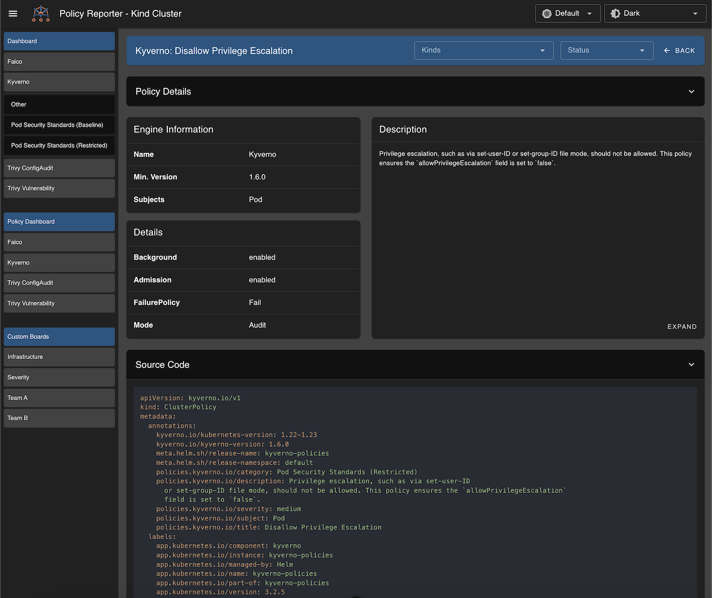

# Installation

It is recommanded to install Policy Reporter via the provided Helm Chart.

## Helm Repository

````bash
helm repo add policy-reporter https://kyverno.github.io/policy-reporter
helm repo update
````

## Base Installation

Installs the Policy Reporter Core application with metrics enabled.

````bash
helm install policy-reporter policy-reporter/policy-reporter --create-namespace -n policy-reporter --set metrics.enabled=true
````

Access the metrics endpoint on [http://localhost:8080/metrics](http://127.0.0.1:8080/metrics) via kubectl port forward:

```bash
kubectl port-forward service/policy-reporter 8080:8080 -n policy-reporter
```

## Base + UI Installation

Installs the Policy Reporter Core + Policy Reporter UI application.

````bash
helm install policy-reporter policy-reporter/policy-reporter --create-namespace -n policy-reporter --set ui.enabled=true
````

Access the Policy Reporter UI endpoint on [http://localhost:8080/](http://127.0.0.1:8080/) via kubectl port forward:

```bash
kubectl port-forward service/policy-reporter-ui 8080:8080 -n policy-reporter
```


## Base + UI + Kyverno Plugin Installation

Installs the Policy Reporter Core, Policy Reporter UI and Policy Reporter Kyverno Plugin application. The plugin provides additional information for Kyverno policies like descriptions, configuration and YAML declaration.

````bash
helm install policy-reporter policy-reporter/policy-reporter --create-namespace -n policy-reporter --set ui.enabled=true --set plugin.kyverno.enabled=true
````

Access the Policy Reporter UI endpoint on [http://localhost:8080/](http://127.0.0.1:8080/) via kubectl port forward:

```bash
kubectl port-forward service/policy-reporter-ui 8080:8080 -n policy-reporter
```


