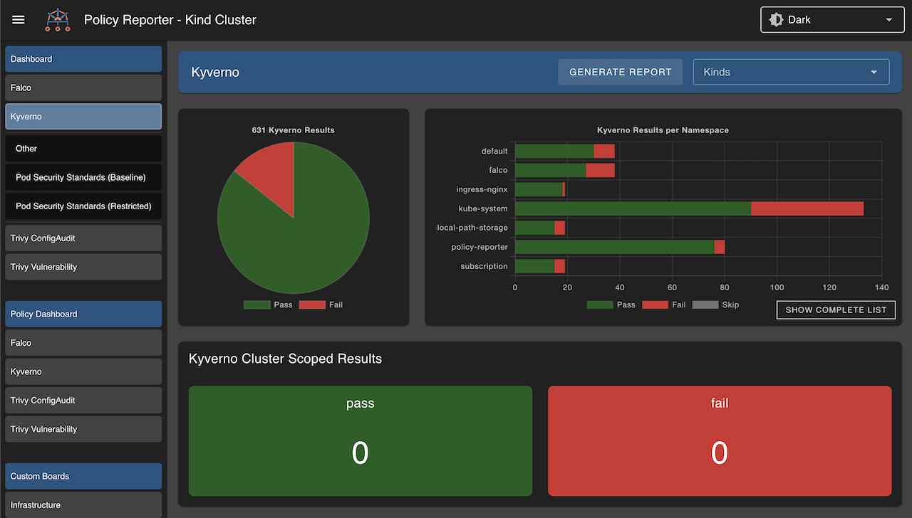
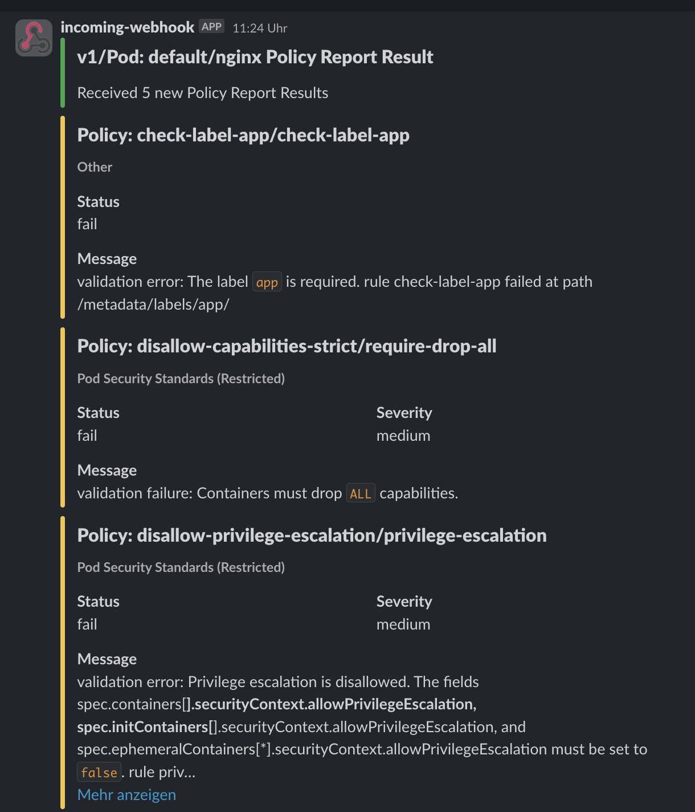

# Introduction

Policy Reporter adds observability and monitoring possibilities to you cluster security based on the [PolicyReport CRDs](https://github.com/kubernetes-sigs/wg-policy-prototypes/blob/master/policy-report/README.md).

It provides common features like

* Metrics
* Webbased User Interface
* Notification pushes
* Integrations with tools like Grafana or SecurityHub
* E-Mail Reports

and more.

## Screenshots

### Policy Reporter UI

### Grafana Dashboards

### Grafana Loki

### Slack Notifications

