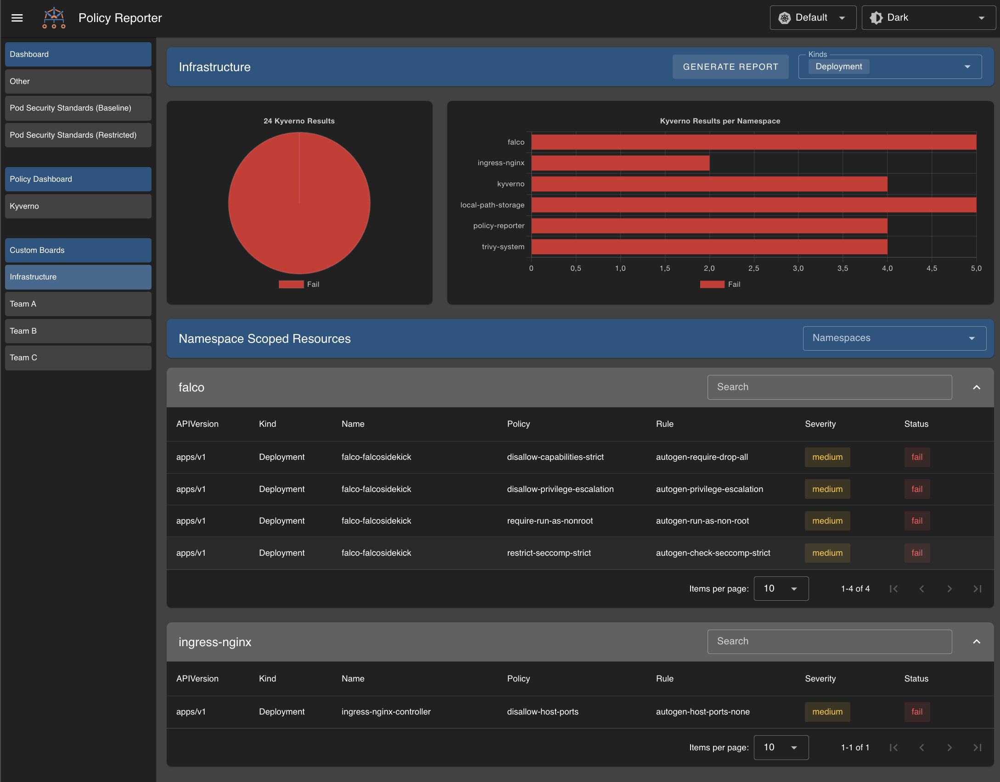

# Custom Boards

Custom Boards allows you to configure additional dashboards with a custom subset of sources and namespaces, selected via a list and/or label selector.

You can also configure filter and how you want to display your results to reflect the needs of the users.

::: info
We support the `CustomBoard` and `NamespaceCustomBoard` CRD since Policy Reporter UI v2.5.0. You need to opt in by setting `ui.crds.customBoard` to `true` in the Helm Chart (since v3.7.0)

The only difference between `CustomBoard` and `NamespaceCustomBoard` is that you can not set a namespace filter in `NamespaceCustomBoard` as always only show results for the namespace they are applied to. `NamespaceCustomBoard` also do not show cluster scoped results.
:::


## Namespace List

Basic Setup with a fixed list of namespaces.

::: code-group

```yaml [values.yaml]
ui:
  enabled: true

  customBoards:
    - name: System
      namespaces:
        list:
          - kube-system
          - kyverno
          - policy-reporter
```

```yaml [config.yaml]
customBoards:
  - name: System
    namespaces:
      list:
        - kube-system
        - kyverno
        - policy-reporter
```

```yaml [CustomBoard CRD]
kind: CustomBoard
apiVersion: ui.policyreporter.kyverno.io/v1alpha1
metadata:
  name: kyverno-results
spec:
  title: System
  namespaces:
    list:
      - kube-system
      - kyverno
      - policy-reporter
```

```yaml [NamespaceCustomBoard CRD]
kind: NamespaceCustomBoard
apiVersion: ui.policyreporter.kyverno.io/v1alpha1
metadata:
  name: policy-reporter
  namespace: policy-reporter
spec:
  title: Policy Reporter
  sources:
    list: [kyverno]
```

:::

### Screenshot


## Namespace Selector

Setup a flexible list of namespaces by using a namespace label selector. Label selectors supporting different operations like `equal`, `exists`, `one of` and `doesnotexist`.

::: code-group

```yaml [values.yaml]
ui:
  enabled: true

  customBoards:
  - name: System
    namespaces:
      selector:
        group: system          # equal check
        app: '*'               # label exists
        service: '!*'          # label does not exists
        tools: 'kyverno,falco' # label tools is one of the defined values: [kyverno, falco]
```

```yaml [config.yaml]
customBoards:
  - name: System
    namespaces:
      selector:
        group: system          # equal check
        app: '*'               # label exists
        service: '!*'          # label does not exists
        tools: 'kyverno,falco' # label tools is one of the defined values: [kyverno, falco]
```

```yaml [CustomBoard CRD]
kind: CustomBoard
apiVersion: ui.policyreporter.kyverno.io/v1alpha1
metadata:
  name: system
spec:
  title: System
  namespaces:
    selector:
      group: system          # equal check
      app: '*'               # label exists
      service: '!*'          # label does not exists
      tools: 'kyverno,falco' # label tools is one of the defined values: [kyverno, falco]
```

:::

### Screenshot


## Source List

Restrict the displayed sources.

::: code-group

```yaml [values.yaml]
ui:
  enabled: true

  customBoards:
  - name: System
    clusterScope:
      enabled: true
    namespaces:
      selector:
        group: system
    sources:
      list: [kyverno]
```

```yaml [config.yaml]
customBoards:
  - name: System
    clusterScope:
      enabled: true
    namespaces:
      selector:
        group: system
    sources:
      list: [kyverno]
```

```yaml [CustomBoard CRD]
kind: CustomBoard
apiVersion: ui.policyreporter.kyverno.io/v1alpha1
metadata:
  name: system
spec:
  title: System
  namespaces:
    selector:
      group: system
  sources:
    list: [kyverno]
```

:::

### Screenshot


## Filter

Filters can be used to reduce displayed information to the needed minimum. Currently only `include` filters are supported. You can set a `results`, `severities`, `namespaceKinds` and `clusterKinds` filter.

### Example

Configure a filter to only show `fail` results of your `Deployment` in all namespaces with a `group:system` label, produced by `kyverno`.

::: code-group

```yaml [values.yaml]
ui:
  enabled: true

  customBoards:
  - name: System
    clusterScope:
      enabled: true
    namespaces:
      selector:
        group: system
    sources:
      list: [kyverno]
    filter:
      results:
        include: [fail]
      namespaceKinds:
        include: [Deployment]
```

```yaml [config.yaml]
customBoards:
  - name: System
    clusterScope:
      enabled: true
    namespaces:
      selector:
        group: system
    sources:
      list: [kyverno]
    filter:
      results:
        include: [fail]
      namespaceKinds:
        include: [Deployment]
```

```yaml [CustomBoard CRD]
kind: CustomBoard
apiVersion: ui.policyreporter.kyverno.io/v1alpha1
metadata:
  name: system
spec:
  title: System
  namespaces:
    selector:
      group: system
  sources:
    list: [kyverno]
  filter:
    results:
      include: [fail]
    namespaceKinds:
      include: [Deployment]
```

:::

## Display

The new UI shows the results grouped by resources in all automatically generated dashboards and by default in custom  boards. For users who prefer the old visualization, it is possible to set `display` to `results`. In this mode, the dashboard will instead display a table with all results in the specified namespaces.

### Example

::: code-group

```yaml [values.yaml]
ui:
  enabled: true

  customBoards:
  - name: System
    display: results
    clusterScope:
      enabled: true
    namespaces:
      selector:
        group: system
    sources:
        list: [kyverno]
    filter:
      include:
        results: [fail]
        namespaceKinds: [Deployment]
```

```yaml [config.yaml]
customBoards:
  - name: System
    display: results
    clusterScope:
      enabled: true
    namespaces:
      selector:
        group: system
    sources:
        list: [kyverno]
    filter:
      include:
        results: [fail]
        namespaceKinds: [Deployment]
```

```yaml [CustomBoard CRD]
kind: CustomBoard
apiVersion: ui.policyreporter.kyverno.io/v1alpha1
metadata:
  name: system
spec:
  title: System
  display: results
  clusterScope:
    enabled: true
  namespaces:
    selector:
      group: system
  sources:
    list: [kyverno]
  filter:
    results:
      include: [fail]
    namespaceKinds:
      include: [Deployment]
```

:::

### Screenshot


