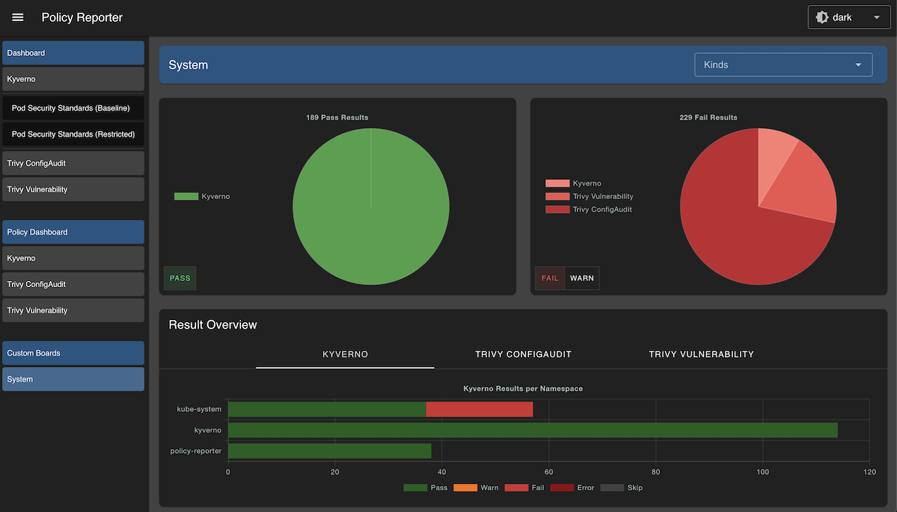
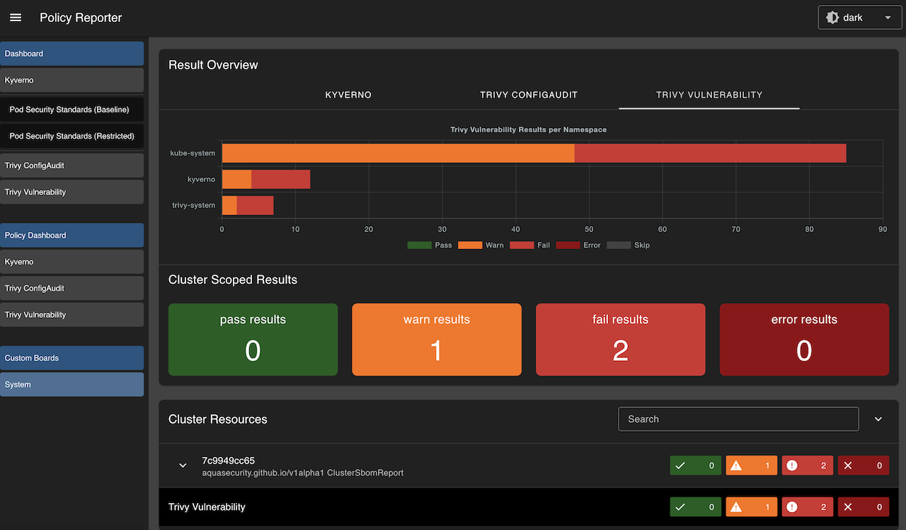
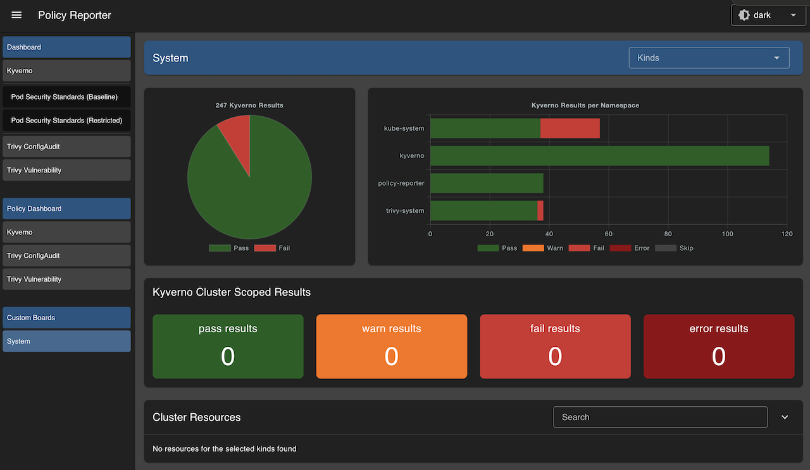
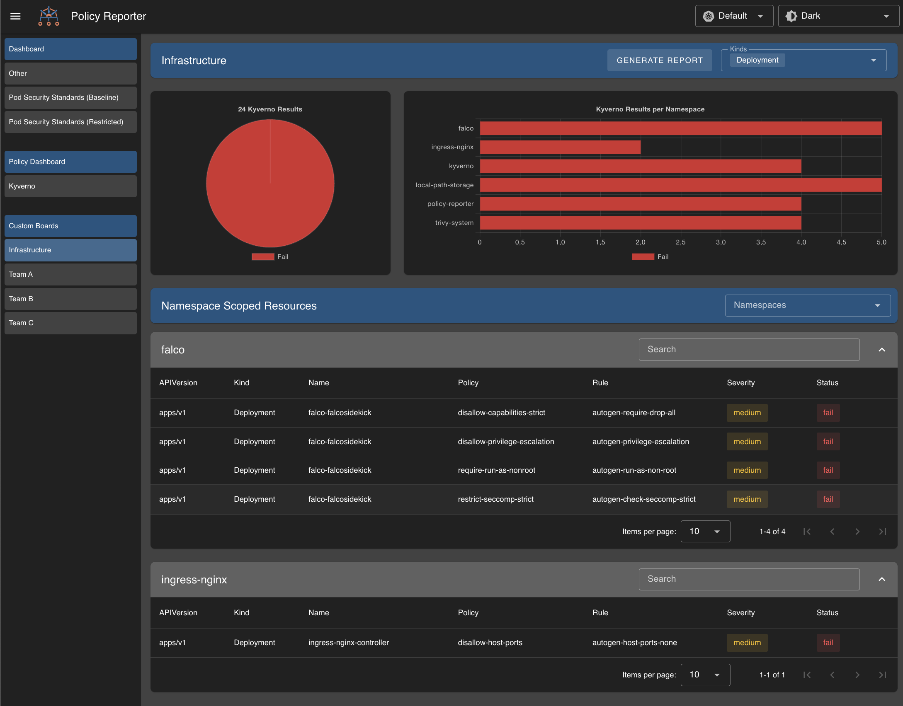

# Custom Boards

Custom Boards allows you to configure additional dashboards with a custom subset of sources and namespaces, selected via a list and/or label selector.

You can also configure filter and how you want to display your results to reflect the needs of the users.

::: info
We support the `CustomBoard` and `NamespaceCustomBoard` CRD since Policy Reporter UI v2.5.0. You need to opt in by setting `ui.crds.customBoard` to `true` in the Helm Chart (since v3.7.0)

The only difference between `CustomBoard` and `NamespaceCustomBoard` is that you can not set a namespace filter in `NamespaceCustomBoard` as always only show results for the namespace they are applied to. `NamespaceCustomBoard` also do not show cluster scoped results.

Short names: `CustomBoard` → `cb`, `NamespaceCustomBoard` → `ncb`
:::


## Namespace List

Basic Setup with a fixed list of namespaces.

::: code-group

```yaml [values.yaml]
ui:
  enabled: true

  customBoards:
    - name: System
      namespaces:
        list:
          - kube-system
          - kyverno
          - policy-reporter
```

```yaml [config.yaml]
customBoards:
  - name: System
    namespaces:
      list:
        - kube-system
        - kyverno
        - policy-reporter
```

```yaml [CustomBoard CRD]
kind: CustomBoard
apiVersion: ui.policyreporter.kyverno.io/v1alpha1
metadata:
  name: kyverno-results
spec:
  title: System
  namespaces:
    list:
      - kube-system
      - kyverno
      - policy-reporter
```

```yaml [NamespaceCustomBoard CRD]
kind: NamespaceCustomBoard
apiVersion: ui.policyreporter.kyverno.io/v1alpha1
metadata:
  name: policy-reporter
  namespace: policy-reporter
spec:
  title: Policy Reporter
  sources:
    list: [kyverno]
```

:::

### Screenshot



## Namespace Selector

Setup a flexible list of namespaces by using a namespace label selector. Label selectors supporting different operations like `equal`, `exists`, `one of` and `doesnotexist`.

::: code-group

```yaml [values.yaml]
ui:
  enabled: true

  customBoards:
  - name: System
    namespaces:
      labelSelector:
        group: system          # equal check
        app: '*'               # label exists
        service: '!*'          # label does not exists
        tools: 'kyverno,falco' # label tools is one of the defined values: [kyverno, falco]
```

```yaml [config.yaml]
customBoards:
  - name: System
    namespaces:
      labelSelector:
        group: system          # equal check
        app: '*'               # label exists
        service: '!*'          # label does not exists
        tools: 'kyverno,falco' # label tools is one of the defined values: [kyverno, falco]
```

```yaml [CustomBoard CRD]
kind: CustomBoard
apiVersion: ui.policyreporter.kyverno.io/v1alpha1
metadata:
  name: system
spec:
  title: System
  namespaces:
    labelSelector:
      group: system          # equal check
      app: '*'               # label exists
      service: '!*'          # label does not exists
      tools: 'kyverno,falco' # label tools is one of the defined values: [kyverno, falco]
```

:::

### Screenshot



## Source List

Restrict the displayed sources.

::: code-group

```yaml [values.yaml]
ui:
  enabled: true

  customBoards:
  - name: System
    clusterScope:
      enabled: true
    namespaces:
      labelSelector:
        group: system
    sources:
      list: [kyverno]
```

```yaml [config.yaml]
customBoards:
  - name: System
    clusterScope:
      enabled: true
    namespaces:
      labelSelector:
        group: system
    sources:
      list: [kyverno]
```

```yaml [CustomBoard CRD]
kind: CustomBoard
apiVersion: ui.policyreporter.kyverno.io/v1alpha1
metadata:
  name: system
spec:
  title: System
  namespaces:
    labelSelector:
      group: system
  sources:
    list: [kyverno]
```

:::

### Screenshot



## Filter

Filters can be used to reduce displayed information to the needed minimum. Both `include` and `exclude` filters are supported. You can set a `results`, `namespaceKinds`, `clusterKinds`, `resources` and `clusterResources` filter.

### Example

Configure a filter to only show `fail` results of your `Deployment` in all namespaces with a `group:system` label, produced by `kyverno`.

::: code-group

```yaml [values.yaml]
ui:
  enabled: true

  customBoards:
  - name: System
    clusterScope:
      enabled: true
    namespaces:
      labelSelector:
        group: system
    sources:
      list: [kyverno]
    filter:
      results:
        include: [fail]
      namespaceKinds:
        include: [Deployment]
```

```yaml [config.yaml]
customBoards:
  - name: System
    clusterScope:
      enabled: true
    namespaces:
      labelSelector:
        group: system
    sources:
      list: [kyverno]
    filter:
      results:
        include: [fail]
      namespaceKinds:
        include: [Deployment]
```

```yaml [CustomBoard CRD]
kind: CustomBoard
apiVersion: ui.policyreporter.kyverno.io/v1alpha1
metadata:
  name: system
spec:
  title: System
  namespaces:
    labelSelector:
      group: system
  sources:
    list: [kyverno]
  filter:
    results:
      include: [fail]
    namespaceKinds:
      include: [Deployment]
```

:::

### Available Filter Fields

| Field | Description |
|---|---|
| `results` | Filter by result status (`pass`, `fail`, `warn`, `error`, `skip`) |
| `namespaceKinds` | Filter namespace-scoped resources by kind |
| `clusterKinds` | Filter cluster-scoped resources by kind |
| `resources` | Filter by specific namespace-scoped resource names |
| `clusterResources` | Filter by specific cluster-scoped resource names |

Each field supports `include` and `exclude` lists. `include` limits results to the listed values; `exclude` removes results matching the listed values.

## Display

::: warning Deprecated
The `display` field is deprecated in favor of [`renderOptions.resultView`](#render-options). It will be removed in a future version.
:::

The new UI shows the results grouped by resources in all automatically generated dashboards and by default in custom boards. For users who prefer the old visualization, it is possible to set `display` to `results`. In this mode, the dashboard will instead display a table with all results in the specified namespaces.

### Example

::: code-group

```yaml [values.yaml]
ui:
  enabled: true

  customBoards:
  - name: System
    display: results
    clusterScope:
      enabled: true
    namespaces:
      labelSelector:
        group: system
    sources:
        list: [kyverno]
    filter:
      include:
        results: [fail]
        namespaceKinds: [Deployment]
```

```yaml [config.yaml]
customBoards:
  - name: System
    display: results
    clusterScope:
      enabled: true
    namespaces:
      labelSelector:
        group: system
    sources:
        list: [kyverno]
    filter:
      include:
        results: [fail]
        namespaceKinds: [Deployment]
```

```yaml [CustomBoard CRD]
kind: CustomBoard
apiVersion: ui.policyreporter.kyverno.io/v1alpha1
metadata:
  name: system
spec:
  title: System
  display: results
  clusterScope:
    enabled: true
  namespaces:
    labelSelector:
      group: system
  sources:
    list: [kyverno]
  filter:
    results:
      include: [fail]
    namespaceKinds:
      include: [Deployment]
```

:::

### Screenshot



## Render Options

`renderOptions` replaces the deprecated `display` field and provides additional rendering configuration. It is supported since Policy Reporter UI v2.7.0.

### `resultView`

Controls how results are displayed within the board. Defaults to `resources` (grouped by resource). Set to `results` to display a flat results table instead.

### `dashboardMode`

Controls the dashboard layout. Defaults to `detailed`. Set to `compact` for a condensed view with less visual spacing — useful when many namespaces or resources need to be shown at a glance.

### Example

::: code-group

```yaml [CustomBoard CRD]
kind: CustomBoard
apiVersion: ui.policyreporter.kyverno.io/v1alpha1
metadata:
  name: system
spec:
  title: System
  renderOptions:
    resultView: results
    dashboardMode: compact
  namespaces:
    list:
      - kube-system
      - kyverno
      - policy-reporter
```

```yaml [NamespaceCustomBoard CRD]
kind: NamespaceCustomBoard
apiVersion: ui.policyreporter.kyverno.io/v1alpha1
metadata:
  name: policy-reporter
  namespace: policy-reporter
spec:
  title: Policy Reporter
  renderOptions:
    resultView: results
    dashboardMode: compact
  sources:
    list: [kyverno]
```

:::

## Access Control

`accessControl` restricts who can view a custom board. It is mutually exclusive: specify either `emails` or `groups` — not both. This is only effective when authentication (OAuth2/OIDC) is configured.

::: info
`accessControl` is supported since Policy Reporter UI v2.5.0.
:::

### Example

::: code-group

```yaml [CustomBoard CRD]
kind: CustomBoard
apiVersion: ui.policyreporter.kyverno.io/v1alpha1
metadata:
  name: kyverno-results
spec:
  title: Kyverno Results
  namespaces:
    labelSelector:
      kubernetes.io/metadata.name: '*'
  sources:
    list: [kyverno]
  accessControl:
    groups:
      - platform-team
      - security-team
```

```yaml [NamespaceCustomBoard CRD]
kind: NamespaceCustomBoard
apiVersion: ui.policyreporter.kyverno.io/v1alpha1
metadata:
  name: fail-board
  namespace: kube-system
spec:
  title: Kube System Failures
  display: results
  sources:
    list: [kyverno, KyvernoValidatingPolicy]
  filter:
    results:
      include: ["fail"]
  accessControl:
    emails:
      - admin@example.com
```

:::

## Policy Report Selector

`policyReports` allows filtering which `PolicyReport` or `ClusterPolicyReport` resources are visualized on the board, using a Kubernetes label selector.

### Example

```yaml [CustomBoard CRD]
kind: CustomBoard
apiVersion: ui.policyreporter.kyverno.io/v1alpha1
metadata:
  name: kyverno-results
spec:
  title: Kyverno Results
  namespaces:
    list:
      - kube-system
      - kyverno
  policyReports:
    labelSelector:
      app.kubernetes.io/managed-by: kyverno
```
