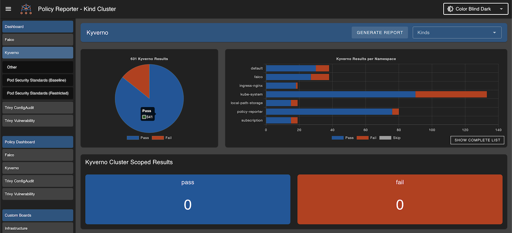

# Customization

There are a few options to customize the UI to your personal preferences.

## DisplayMode

Defines the default display mode of the UI, defaults to your OS preference setting. Possible values are `dark`, `light`, `colorblind`, `colorblinddark`.

::: code-group

```yaml [values.yaml]
ui:
  displayMode: 'colorblinddark'
```

```yaml [config.yaml]   
ui:
  displayMode: 'colorblinddark'
```

:::



## Banner

Adds custom suffix text to the UI. Can be helpful if you are running multiple UIs in different clusters.

::: code-group

```yaml [values.yaml]
ui:
  banner: 'Kind Cluster'
```

```yaml [config.yaml]   
ui:
  banner: 'Kind Cluster'
```

:::


