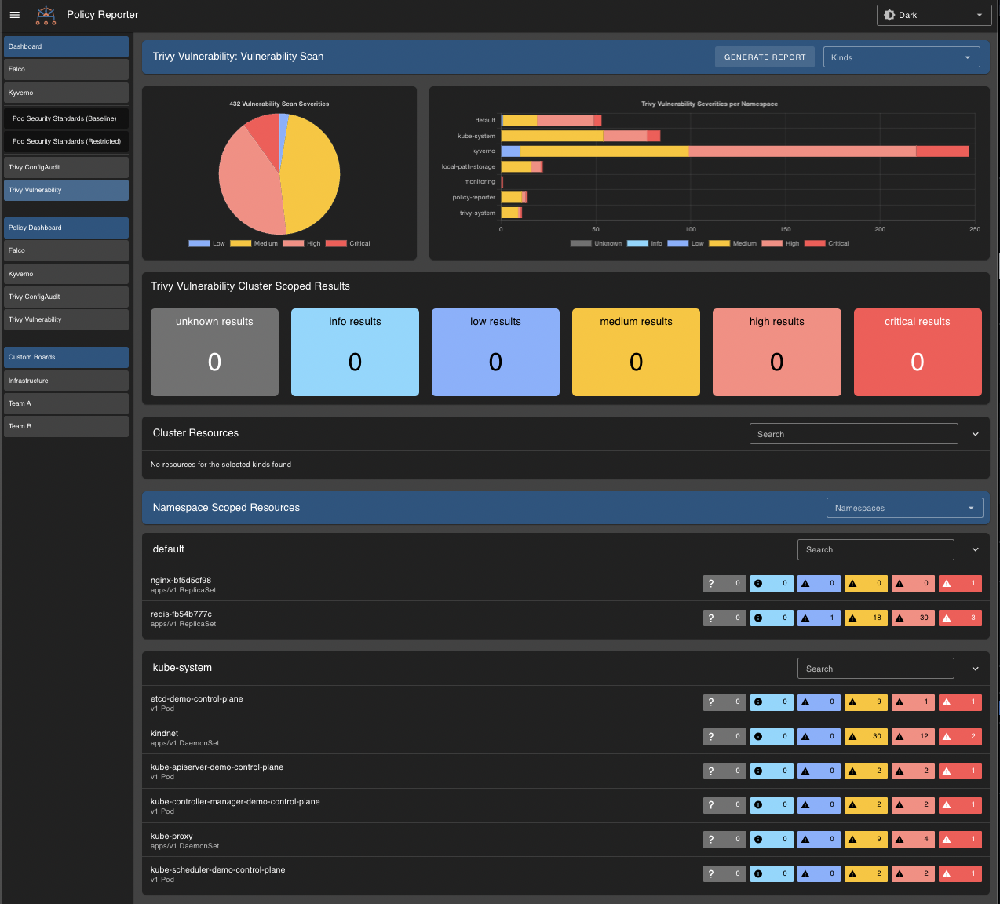

# Source Configuration

Depending on the engine/source that creates a PolicyReport, there are differences in the meaningful presentation of the information provided. To address this, it is possible to adjust the visualization per source in Policy Reporter UI.

## Example

::: code-group

```yaml [values.yaml]
ui:
  enabled: true
  sources:
    - name: kyverno
      exceptions: true
      viewType: status
      excludes:
        results:
          - warn
```

```yaml [config.yaml]
sources:
  - name: kyverno
    exceptions: true
    viewType: status
    excludes:
      results:
        - warn
```

:::

## Configuration

### Name

The name of a source configuration relates to the `source` field in the related PolicyReports. The example above relates to all reports producded by Kyverno which sets the `source` field in its report to `kyverno`.

### Exception

This relates to the **Policy Reporter Plugin System** which provides an optional _exceptions_ API. When enabled it shows Button to create _exceptions_ for a given **Resource** and **Policy**. This feature only works when a **Plugin** for the given `source` exists which implements the _execptions_ API.

### Excludes

This option makes it possible to hide different information from the UI which are uninteresting. This can be a list of `results`, `severities`, `namespaceKinds` or `clusterKinds`.

Since Kyverno validation does not produce `warn` results, we do not want to display it in our Kyverno dashboards, so we exclude it in our example configuration.

### ViewType

Some sources like Trivy don't produce pass results and mainly show existing failures. In this cases the default dashboards don't produce much value because they give no insights which failures are really important. For this sources you can set the `viewType` to `severity`. Means all information will be grouped by `severity` rather then the `result` which makes them more valuable.

The `viewType` has no effect on dashboards in which multiple sources are visible and some of them use the default value.


